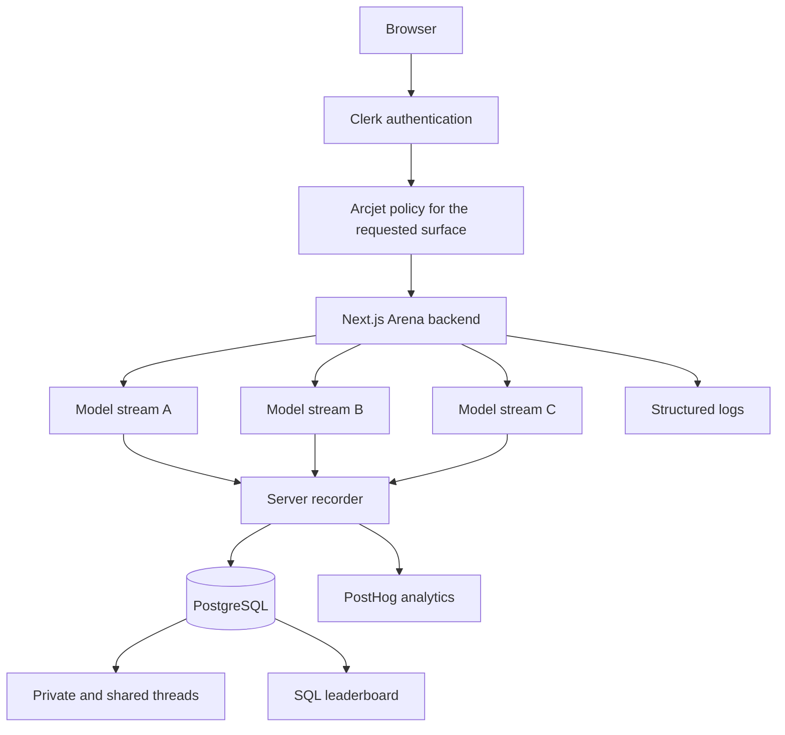

# LLM Arena

LLM Arena sends one prompt to up to three free AI models, streams their answers independently, and lets the user vote for the best response. Persisted server measurements and real votes build global and personal leaderboards.

V1 proves the product. V2 hardens the backend around trust, concurrency, failure, observability, verification, data lifecycle, database performance and delivery.

## Architecture



Each model has its own HTTP request and SSE stream. One slow or failed model does not hold the other lanes open. The server claims the thread, turn and message row before calling OpenRouter, records checkpoints while reading the upstream stream, and sends a final authoritative metrics frame to the browser.

The browser can display live estimates but cannot choose persisted answer content, status, TTFT, token counts or speed. Retries reuse one message row and increment its attempt number, so a stale stream cannot overwrite a newer attempt.

## Privacy and sharing

Threads are private by default. `/arena/{threadId}` is owner only. Sharing creates a 256 bit token and stores only its SHA 256 hash. The public `/share/{token}` page is read only and marked `noindex`. Unshare revokes the copied URL immediately, sharing again rotates it, and thread deletion cascades through its turns, messages, votes and share record.

## Protection and operations

Clerk owns identity. Every mutation checks ownership on the server. Arcjet uses separate limits and policies for model inference, writes and anonymous public reads. Structured logs carry request, thread, turn, message, model and attempt correlation fields. PostHog receives product events and model measurements, but analytics failures never fail a generation.

## Stack

Next.js 16 App Router, React 19, TypeScript, PostgreSQL, Prisma 7, Clerk, OpenRouter, Arcjet, PostHog, Tailwind CSS 4 and Vitest.

## Local setup

Use Node 24 and pnpm 11.

```bash
pnpm install
cp .env.example .env.local
pnpm prisma migrate deploy
pnpm dev
```

Fill every application variable in `.env.example`. `TEST_DATABASE_URL` must point at a database different from `DATABASE_URL`. Database tests create and delete rows and refuse to run when the two URLs match.

## Verification

```bash
pnpm format:check
pnpm lint
pnpm typecheck
pnpm test:unit
pnpm test:db
pnpm build
```

GitHub Actions runs each quality gate. Database tests receive a fresh PostgreSQL service container and apply committed migrations before Vitest starts. Visible behavior is still checked using [the manual browser pass](docs/manual-pass.md).

## Current deployment

The public portfolio deployment is a Vercel Preview at [llm-arena-yuc3htahf-eliyacohen2019-5505s-projects.vercel.app](https://llm-arena-yuc3htahf-eliyacohen2019-5505s-projects.vercel.app). It is intentionally a demonstration environment, not a claim of production scale. Free OpenRouter models can be temporarily busy or rate limited, and one failed lane does not fail the other model streams.

## Deployment

GitHub Actions is the only deployment owner. After CI passes, it checks out the exact verified commit, applies compatible Prisma migrations to the staging database, builds with a pinned Vercel CLI and deploys the prebuilt artifact to Vercel Preview. A protected `/api/health` request verifies both the application and its database after deployment.

The public portfolio demo intentionally runs as a `*.vercel.app` Preview deployment. It uses isolated staging services and Clerk development or test credentials, alongside staging PostgreSQL, Arcjet and PostHog configuration. A custom domain and a Clerk Production environment are not required for this portfolio target. This keeps the demo deployable at no domain cost while preserving CI gates, environment isolation, reviewed migrations and post deploy verification.

There is no active Vercel Production deployment or production alias rollback workflow. Those would be separate future operating decisions if the project ever moved beyond its portfolio deployment model.

Repository settings and required secrets are listed in [the operations runbook](docs/runbook.md). Capacity methodology and measured results live in [the capacity report](docs/capacity.md).

## Important tradeoffs

The system keeps synchronous independent streams because streaming is the product and no measured bottleneck has justified a queue. The leaderboard moved into one SQL aggregation after measurement showed that transferring every vote to Node was the actual cost. It deliberately has no cache yet because the measured query is acceptable and stale rankings would add complexity without evidence.

## Known limitations and future improvements

Abandoned generation cleanup currently uses message age through `createdAt`. A future maintenance change could use an explicit heartbeat or lease such as `lastActivityAt` or `leaseExpiresAt` when measured workloads justify the additional writes and lifecycle state.

Conversation history sent to a model is assembled by the client from the visible thread state. Rebuilding that history on the server from persisted turns would strengthen the trust boundary, but no current correctness failure justifies adding it during V2 closure.

The free OpenRouter catalog is operationally variable. A model can return a transient `429` or provider busy response even when it appears in the live catalog. The Arena treats this as a per lane failure, keeps successful lanes usable and offers an explicit retry.

Architecture decisions are recorded under [`docs/adr`](docs/adr). The V1 build record is [scope.md](docs/scope.md), and the V2 engineering hardening record is [scope-v2.md](docs/scope-v2.md).
